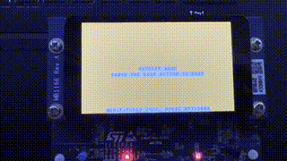
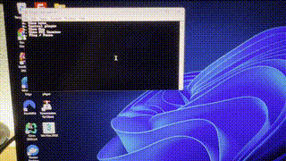

# Raycast Maze

## Overview
Raycast Maze is a first-person maze game developed as a university project, running on FreeRTOS. The game challenges players to navigate through a maze, finding the exit while encountering various obstacles. Features include a touchscreen or serial console for navigation, a pause button, an optional minimap, and an FPS counter. The raycaster is loosely inspired to the one made by ["3DSage"](https://github.com/3DSage/OpenGL-Raycaster_v1) 

## Hardware Resources
Developed on the STM32F769I-DISCO board, Raycast Maze utilizes:
- B-LCD40-DSI1 daughterboard for LCD display and touch panel.
- SDRAM for display buffering.
- USER button for pausing the game.
- USB for UART virtual serial port.
- TIM2 and TIM6 timers for game and FreeRTOS operations.

## Software Structure
The software includes header and implementation files (excluding STM-CUBE IDE-generated ones):
- **Game**: Handles logic for character movement and screens.
- **Render**: Uses raycasting for environment rendering.
- **Main_user.c**: Manages main loop and initialization.

## Execution Flow
The `main()` function initializes peripherals, with `freeRTOS_user_init()` in `main_user.c` setting up the main loop, default values, and game logic. Key tasks:
- **Button Task**: Manages game pausing.
- **UART Task**: Handles serial console input, enabling players to control the game and navigate menus. It's possible to show a minimap, control the character through the keyboard, show a FPS counter.

- **Main Task**: Draws each frame and manages game logic.

## Building the Project
- **IDE Requirement**: STM32Cube IDE.
- **Firmware Version**: STM32F7 firmware version F7 V1.17.1.
- **Toolchain**: GNU Tools for STM32 (10.3-2021.0).

This README offers a concise overview of the Raycast Maze project, highlighting its use of FreeRTOS, hardware and software architecture, execution flow, and building instructions.
